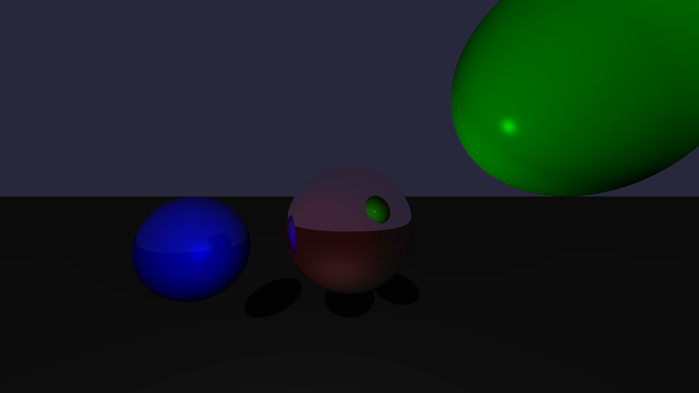

# raytracer-rs
raytracer implemented in rust. Output with [image crate](https://crates.io/crates/image)

### Images
  
With directional, ambient and point light

  
Adding shadow, still with shadow acne present. Looks pretty cool though. 

Recursive reflections finally work.
